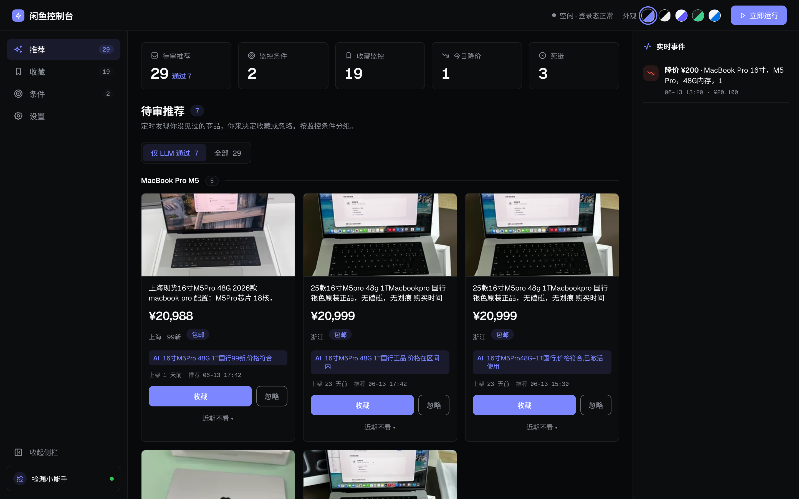
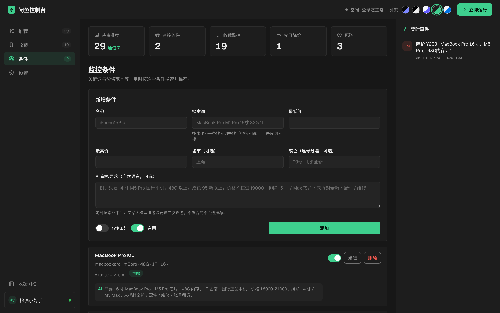
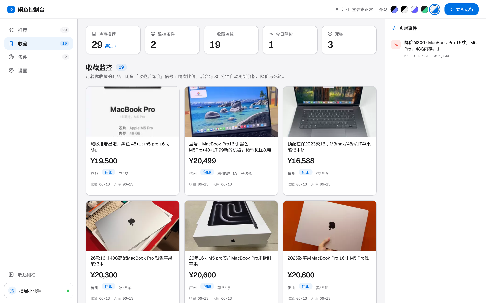
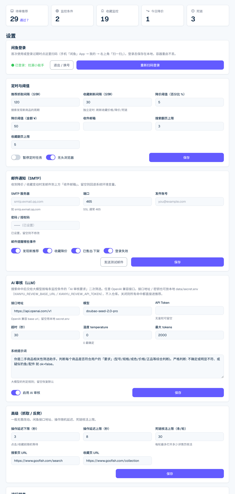
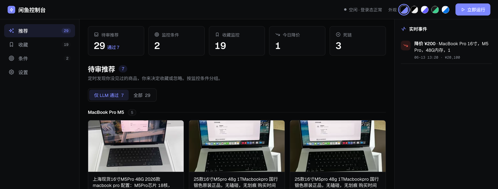
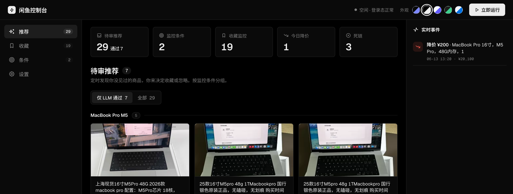
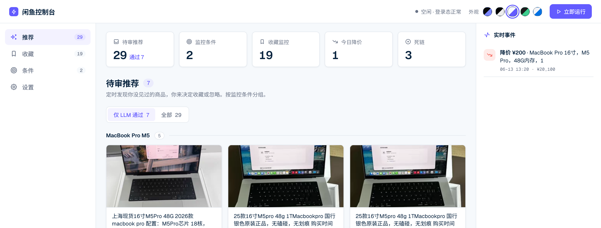
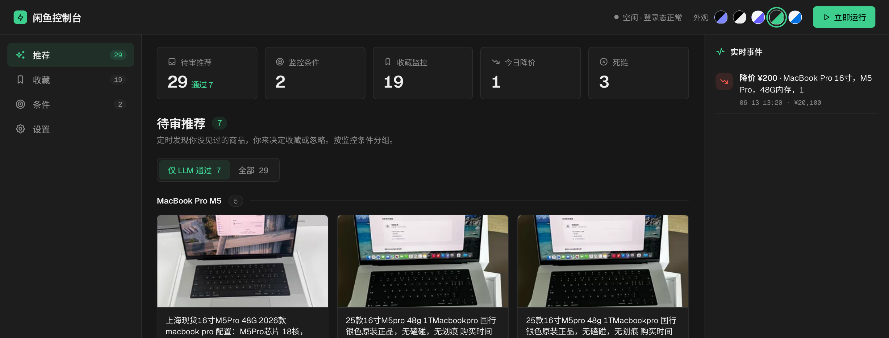
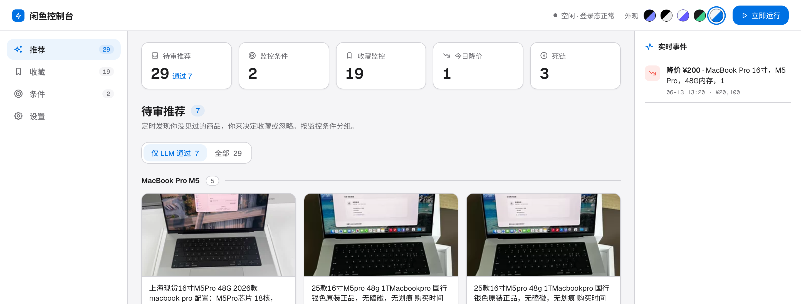
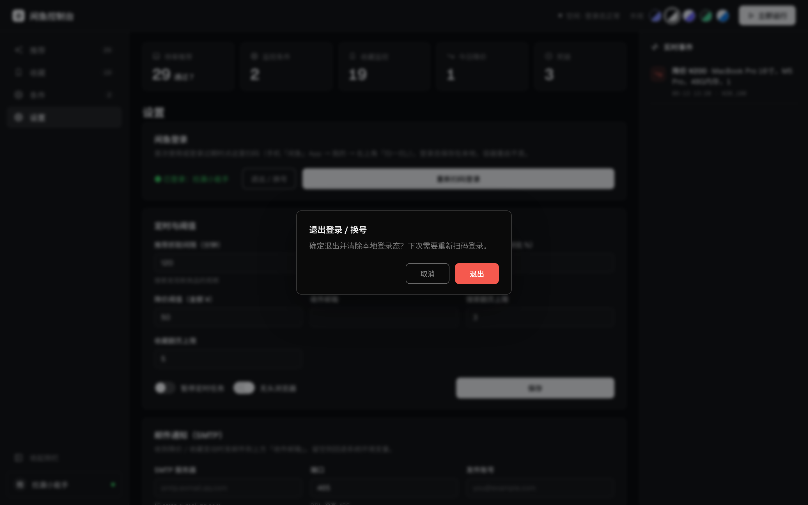

<div align="center">

# 🐟 GooFish-AIMonitor · 闲鱼智能监控控制台

帮你盯着闲鱼：按你的要求自动搜货、请大模型逐个把关，收藏的东西一降价就提醒。
全程跑在你自己电脑上，打开浏览器就能用，数据不外传。

<br/>



<br/>

`Python` · `FastAPI` · `Playwright` · `React + Vite` · `SQLite` · `Docker`

[这是什么](#这是什么) · [能帮你做什么](#它能帮你做什么) · [五套配色](#-五套配色随心换) · [下载即用](#-下载即用) · [跑起来](#跑起来) · [数据安全](#数据都在你自己手里)

</div>

---

## 这是什么

在闲鱼淘二手，麻烦的从来不是挑，而是盯：一个关键词搜出来半屏都不对版，型号还混着配件、维修件；价格隔天就变；收藏夹攒了几十个，根本盯不过来；好不容易下定决心，东西已经被人买走了。

**GooFish-AIMonitor 就是来替你盯的。** 你把要盯的商品和要求设好，它定时去搜、请大模型逐个把关，只把真正对版、你又没见过的挑给你；你收藏的商品它在后台盯着，一降价立刻发邮件。整套东西跑在你自己电脑上，开浏览器就能用。

---

## 它能帮你做什么

### 📝 先设好监控条件



在「条件」页设好你想盯的方向，想盯几类就建几条：

- 关键词、价格区间、城市、成色，按需要填
- 再写**一句话要求**交给大模型把关，比如「只要 14 寸 M4 Pro 国行、48G 以上、95 新以上、不超过 19000，排除 16 寸和全新」
- 每条都能单独启用 / 停用、随时改
- 看中某个具体商品？直接**收藏**它，就会进收藏监控盯着降价

### 🎯 让大模型逐个把关

搜到的每个商品，都会连着你那句要求一起交给大模型判断对不对版。不合格的也不会丢掉，而是留下来并标明理由，你随时能在「只看通过」和「看全部」之间切换。

- 先按关键词、价格、城市、成色做一轮规则筛选，再用大模型二次把关（兼容任意 OpenAI 接口，模型和提示词都能改）
- 每张卡片都标好价格、成色，以及上架、推荐、调价时间和大模型给的理由
- 看中了一键收藏，不想要就忽略，暂时不想看可以静音一天、七天或永久
- 待审的商品按条件自动分好组

### 📉 收藏降价，第一时间知道



- 醒目的「收藏后降 ¥200」红标，降了多少一眼看清
- 上架、收藏、调价、入库时间，连同地区、成色、包邮、卖家，都给你列明白
- 用的是闲鱼自己的「收藏后降价」数据，连你盯上它之前发生的降价也能补抓
- 卖掉或下架的链接自动变灰划掉，不再点进去白高兴一场

### ⏰ 定时盯着，等不及就手动刷

- 两条**互相独立**的定时任务：选品抓取、收藏刷新，频率各自可调
- 想暂停随时暂停；改完频率立刻生效
- 等不及下一轮？顶栏点一下「**立即运行**」，马上手动跑一遍

### 🔔 提醒按事件分开配

每一类事件都能单独决定要不要发邮件：

- **发现新推荐**、**收藏降价**、**已售出 / 下架**、**登录失效**，想收哪个勾哪个
- 邮件会附上新发现的价格、降价前后对比；没配 SMTP 也不耽误，自动退回到只写本地 CSV
- 右侧还有一栏**实时事件流**，新发现、降价、售出、登录的动静滚动着看

### ⚙️ 全在网页里配，一处都不写死



设置里能调的东西很多，而且没有一处写死在代码里：

- **扫码登录**直接在网页完成，扫完有「扫码成功、登录中」实时提示，随时退出换号
- 定时频率、降价阈值、收件邮箱、SMTP、大模型接口、抓取节奏，全做成了表单
- 邮箱、密钥、接口地址这些敏感信息只存在本地，仓库里一行都没有

---

## 🎨 五套配色，随心换

顶栏点一下就换，换好会替你记住。配色都是照着这几家的真实风格调的：

<table>
<tr>
<td width="50%" align="center"><b>Linear</b> · 靛蓝暗色<br/></td>
<td width="50%" align="center"><b>Vercel</b> · 极简纯黑<br/></td>
</tr>
<tr>
<td align="center"><b>Stripe</b> · 蓝紫亮色<br/></td>
<td align="center"><b>Supabase</b> · 翡翠暗色<br/></td>
</tr>
<tr>
<td align="center"><b>Apple</b> · 苹果亮色<br/></td>
<td align="center"><i>侧边栏可收起 · 应用内统一对话框</i><br/></td>
</tr>
</table>

---

## ⬇️ 下载即用

**Mac / Windows 都有安装包，不用配环境**——双击就开,会弹出一个**独立的应用窗口**(不是在你浏览器里开标签页)。Chromium 已经打进包里,装完离线即用。

**[→ 前往 Releases 下载最新版](https://github.com/tristanwqy/GooFish-AIMonitor/releases/latest)**

| 你的电脑 | 下载哪个文件 |
|---|---|
| Mac · Apple 芯片（M1/M2/M3/M4） | `GooFish-AIMonitor-macos-arm64-*.dmg` |
| Windows 10 / 11（64 位） | `GooFish-AIMonitor-Setup-*.exe` |

> macOS 目前只出 Apple 芯片版;2021 年前的 Intel Mac 暂不支持,可用下面的 Docker / 源码方式跑。

装好打开会自动弹浏览器到 `http://127.0.0.1:8000`，扫码登录即用。数据存在你的用户目录（Mac `~/Library/Application Support/GooFish-AIMonitor`、Windows `%APPDATA%\GooFish-AIMonitor`），升级卸载都不丢，和 Docker 版互不干扰。想自己出包或看打包原理，见 [`docs/RELEASE.md`](docs/RELEASE.md)。

---

## 跑起来

> 适合想常驻后台、开机自启，或要改源码的场景。只是想用，直接看上面的 [下载即用](#-下载即用) 就行。

### 用 Docker（省心，还能开机自启）

```bash
# 1) 想收邮件就填一下密钥（不填也行，会自动退回到只写本地 CSV）
cp .env.example data/secret.env        # 按需填 XIANYU_SMTP_* / XIANYU_NOTIFY_TO

# 2) 一键起（国内网络慢可加 --build-arg PYTHON_IMAGE=<你的镜像源>/python:3.12-slim）
docker compose up -d

# 3) 打开 http://127.0.0.1:8000 → 设置 → 闲鱼登录 → 手机扫码
```

> 想开机自启：Docker Desktop 勾上「登录时启动」就行，容器已经配了 `restart: unless-stopped`。

### 本地跑

```bash
pip install -e ".[dev]" && playwright install chromium
cd frontend && npm install && npm run build && cd ..
xianyu serve                           # 打开 http://127.0.0.1:8000
```

---

## 它是怎么运转的

```
浏览器 (127.0.0.1:8000) ── React 全屏控制台
        │
   FastAPI ── 定时调度（两条独立周期：选品抓取 + 收藏刷新）
        │     └ Playwright 保存登录态、随机节奏，尽量降低风控
        ▼
  选品：搜索 → 规则筛 → 大模型把关 → 推荐（由你来收藏）
  监控：读收藏夹 → 比价 / 收藏后降价 → 降价提醒 → 邮件
        ▼
  本地 SQLite · 邮件 (SMTP) · events.csv
```

几个关键细节：商品的**上架时间**取自搜索接口；降价主要看闲鱼自己的「收藏后累计降价」字段，比单纯跨次比价更准、还能补抓早先的降价；链接是不是已经卖掉/删除，靠收藏接口的状态加详情页核活一起判断。

---

## 数据都在你自己手里

- **只在本机跑**：服务只监听 `127.0.0.1`，数据全部留在你电脑的 `data/` 目录，不上传、不外发。
- **仓库里没有隐私**：邮箱、密钥、大模型接口地址，都从本地文件（已 gitignore）或系统环境变量读，代码里一行都不写死。
- 登录态、数据库、密钥、缓存，统统在 `.gitignore` 里。

---

## 用到的技术

后端 `Python 3.12` · `FastAPI` · `APScheduler` · `Playwright` · `SQLAlchemy` · `Pydantic`　｜　前端 `React 18` · `Vite` · `react-router` · Geist / Noto Sans SC　｜　部署 `Docker`

> 给 AI 协作者看的工程约定在 [`AGENTS.md`](AGENTS.md)。

---

## 一点说明

这个工具是给个人小流量自用、图个方便的。闲鱼的用户协议一般不允许自动化访问，程序里虽然加了限量、随机延时和风控识别，但还请你自己掂量风险，出了问题自负。
